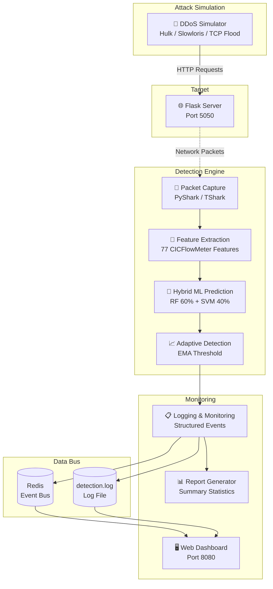
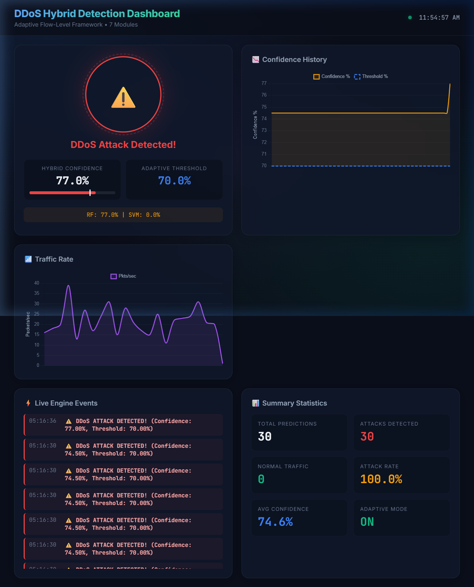

# DDoS Detection Simulator — Project Walkthrough

A comprehensive guide to the architecture, detection pipeline, and operation of the DDoS Detection Simulator.

---

## Table of Contents

1. [Project Overview](#project-overview)
2. [System Architecture](#system-architecture)
3. [Detection Pipeline — How It Works](#detection-pipeline--how-it-works)
4. [Project Structure](#project-structure)
5. [Detailed File Reference](#detailed-file-reference)
6. [Configuration & Environment Variables](#configuration--environment-variables)
7. [How to Run the Project](#how-to-run-the-project)
8. [Dashboard](#dashboard)
9. [Troubleshooting](#troubleshooting)

---

## Project Overview

This project is a full-stack environment for simulating, monitoring, and detecting **Application-Layer DDoS attacks** in real-time. It combines:

- **Network packet analysis** via PyShark (TShark wrapper)
- **Hybrid Machine Learning** (Random Forest + SVM ensemble)
- **Adaptive thresholding** using Exponential Moving Average (EMA)
- **Real-time web dashboard** with Chart.js visualizations

The system is built as a **7-module architecture**, where each module handles a distinct responsibility in the detection pipeline.

### The Four Pillars

| Pillar | Component | Description |
|--------|-----------|-------------|
| **Target** | `app/server.py` | Flask web server that receives traffic |
| **Attacker** | `app/ddos_simulator.py` | Generates normal and attack traffic (Hulk, Slowloris, TCP Flood) |
| **Guard** | `app/detection.py` | Real-time detection engine monitoring network packets |
| **Monitor** | `app/dashboard.py` | Web dashboard for live visualization and alerts |

---

## System Architecture



---

## Detection Pipeline — How It Works

The system processes network traffic through a 4-step pipeline:

### Step 1: Packet Capture (Module 2)
> **File:** `app/detection.py`

The detection engine uses **PyShark** to capture every TCP packet heading toward the target server on port 5050. It applies a BPF filter (`tcp port 5050`) to focus only on relevant traffic. Captured packets are passed one-by-one into the feature extraction module.

### Step 2: Feature Extraction (Module 3)
> **File:** `app/feature_extraction.py`

Raw packets are converted into a **77-dimensional numerical feature vector** compatible with the CICFlowMeter format. Features include:

| Category | Examples |
|----------|---------|
| **Flow duration** | Total flow time in microseconds |
| **Packet counts** | Forward/backward packet counts |
| **Byte statistics** | Mean, std, max, min packet lengths |
| **Inter-arrival times** | Mean, std, max, min IAT (forward and backward) |
| **TCP flags** | SYN, FIN, RST, PSH, ACK, URG counts |
| **Rate features** | Packets/sec, bytes/sec (forward and backward) |
| **Window sizes** | Initial TCP window bytes |
| **Active/idle times** | Mean, std, max, min active and idle durations |

Key behaviors:
- Flows are tracked per 4-tuple `(src_ip, dst_ip, src_port, dst_port)`
- Predictions are only triggered after a flow accumulates **10 packets** (configurable via `MIN_PACKETS_FOR_PREDICTION`)
- Predictions are **throttled to every 10 packets** to prevent CPU overload during attacks
- Flows idle for **>30 seconds** are automatically reset to prevent stale data contamination

### Step 3: Hybrid ML Prediction (Module 4)
> **File:** `app/model_prediction.py`

The feature vector is scaled using a pre-trained Min-Max scaler and then evaluated by two ML models:

| Model | Weight | Strength |
|-------|--------|----------|
| **Random Forest** | 60% (default) | Excellent at detecting complex, non-linear attack patterns |
| **SVM** | 40% (default) | Establishes a clear decision boundary between normal and attack traffic |

The final **Attack Confidence Score** is a weighted average of both models' probabilities:

```
confidence = (RF_weight × RF_probability + SVM_weight × SVM_probability) / (RF_weight + SVM_weight)
```

> [!IMPORTANT]
> **Dummy SVM Detection:** If the SVM model was generated by `scripts/generate_dummy_models.py` (trained on random data), it is automatically detected by checking the number of support vectors. Dummy models (<200 SVs) are disabled at startup with a warning, and the system falls back to RF-only mode to protect prediction accuracy.

### Step 4: Adaptive Thresholding (Module 5)
> **File:** `app/adaptive_detection.py`

Instead of using a static threshold (e.g. "attack if confidence > 70%"), the system dynamically adjusts the detection threshold based on real-time traffic patterns:

1. **EMA Baseline:** An Exponential Moving Average tracks the "normal" packet rate. The smoothing factor is `α = 0.3`.

2. **Spike Detection:** If the current packet rate exceeds **3×** the EMA baseline, a traffic spike is declared.

3. **Threshold Adjustment:** During a spike, the threshold is **lowered** (e.g. 70% → 50%), making the system **more sensitive** to attacks when suspicious traffic patterns appear.

4. **Idle Decay:** When no packets arrive, the EMA baseline automatically decays toward zero over time. This prevents a stale baseline from masking subsequent attacks.

5. **Warm-up Period:** The first 10 samples are used to stabilize the EMA baseline. During this period, all alerts are suppressed to prevent false positives from startup traffic.

> [!NOTE]
> The minimum threshold during a spike is capped at **50%** to prevent over-sensitivity on every packet.

---

## Project Structure

```
ddos-detection-simulator/
├── app/                          # Core application modules
│   ├── __init__.py
│   ├── server.py                 # Module 1: Flask target server
│   ├── detection.py              # Module 2: Packet capture orchestrator
│   ├── feature_extraction.py     # Module 3: 77-feature CICFlowMeter extraction
│   ├── model_prediction.py       # Module 4: Hybrid RF+SVM prediction engine
│   ├── adaptive_detection.py     # Module 5: EMA-based adaptive thresholding
│   ├── logging_monitor.py        # Module 6: Centralized logging & event buffer
│   ├── report_generator.py       # Module 7: Summary statistics & JSON export
│   ├── dashboard.py              # Web dashboard backend (Flask)
│   ├── ddos_simulator.py         # Attack traffic generator
│   └── templates/
│       └── dashboard.html        # Dashboard UI (HTML/CSS/JS + Chart.js)
│
├── config/
│   └── settings.py               # Centralized configuration (all env vars)
│
├── models/
│   ├── random_forest_..._model.pkl    # Pre-trained Random Forest model
│   ├── random_forest_..._scaler.pkl   # Min-Max feature scaler
│   └── svm_model.pkl                  # SVM model (dummy or trained)
│
├── scripts/
│   ├── train_model.py            # Train the Random Forest model
│   ├── train_svm.py              # Train the SVM model on real data
│   ├── generate_dummy_models.py  # Generate placeholder SVM for testing
│   ├── quick_test.sh             # One-command Docker build & test
│   ├── cleanup.sh                # Docker cleanup utility
│   └── ...                       # Other utility scripts
│
├── tests/
│   └── test_detection.py         # Unit tests (9 tests)
│
├── logs/                         # Runtime logs (auto-created)
│   ├── detection.log             # Detection engine events
│   └── server.log                # Flask server requests
│
├── Dockerfile                    # Container build recipe
├── docker-compose.yml            # Multi-container orchestration (5 services)
├── requirements.txt              # Python dependencies
└── walkthrough.md                # This file
```

---

## Detailed File Reference

### 📡 Core Detection Modules

| File | Module | Role |
|------|--------|------|
| `app/detection.py` | 2 – Traffic Capture | Starts PyShark packet capture, orchestrates the pipeline |
| `app/feature_extraction.py` | 3 – Feature Extraction | Converts packets to 77-feature vectors, manages flow tracking |
| `app/model_prediction.py` | 4 – Hybrid ML | Runs RF+SVM ensemble, computes weighted confidence score |
| `app/adaptive_detection.py` | 5 – Adaptive Detection | EMA baseline tracking, dynamic threshold adjustment |

### 🖥️ Application Services

| File | Role |
|------|------|
| `app/server.py` | Flask web server — the DDoS target (port 5050) |
| `app/dashboard.py` | Dashboard backend — serves UI and `/api/data` endpoint (port 8080) |
| `app/ddos_simulator.py` | Multi-threaded attack generator (Hulk, Slowloris, TCP Flood) |

### 📋 Support Modules

| File | Role |
|------|------|
| `app/logging_monitor.py` | Centralized logging, in-memory event buffer, Redis bridge |
| `app/report_generator.py` | Generates summary statistics and JSON reports |
| `config/settings.py` | All configuration values with environment variable overrides |

### 🔧 Scripts

| Script | Purpose |
|--------|---------|
| `scripts/train_model.py` | Train the Random Forest model on CICFlowMeter CSV data |
| `scripts/train_svm.py` | Train the SVM model on the same dataset |
| `scripts/generate_dummy_models.py` | Generate a placeholder SVM for out-of-box testing |
| `scripts/quick_test.sh` | One-command Docker build, launch, and test |

---

## Configuration & Environment Variables

All settings are managed via `config/settings.py` and can be overridden with environment variables.

### Core Settings

| Variable | Default | Description |
|----------|---------|-------------|
| `LOG_LEVEL` | `INFO` | Logging verbosity (DEBUG, INFO, WARNING, ERROR) |
| `DEBUG` | `False` | Enable Flask debug mode |

### ML Model Settings

| Variable | Default | Description |
|----------|---------|-------------|
| `HYBRID_MODE` | `False` | Enable RF+SVM hybrid ensemble |
| `RF_WEIGHT` | `0.6` | Random Forest weight in hybrid scoring |
| `SVM_WEIGHT` | `0.4` | SVM weight in hybrid scoring |
| `MIN_PACKETS_FOR_PREDICTION` | `10` | Minimum packets before prediction triggers |

### Adaptive Detection Settings

| Variable | Default | Description |
|----------|---------|-------------|
| `ADAPTIVE_MODE` | `True` | Enable dynamic threshold adjustment |
| `BASE_THRESHOLD` | `0.70` | Normal-state confidence threshold (70%) |
| `MAX_THRESHOLD` | `0.85` | Maximum threshold ceiling |
| `SPIKE_MULTIPLIER` | `3.0` | Rate must exceed 3× EMA baseline to trigger spike |
| `EMA_ALPHA` | `0.3` | EMA smoothing factor (higher = more responsive) |
| `ADAPTIVE_WINDOW` | `10` | Traffic history window in seconds |

### Network Settings

| Variable | Default | Description |
|----------|---------|-------------|
| `FLASK_HOST` | `0.0.0.0` | Target server bind address |
| `FLASK_PORT` | `5050` | Target server port |
| `DASHBOARD_HOST` | `0.0.0.0` | Dashboard bind address |
| `DASHBOARD_PORT` | `8080` | Dashboard port |
| `NETWORK_INTERFACE` | Auto-detected | Capture interface (e.g. `\Device\NPF_Loopback` on Windows) |
| `BPF_FILTER` | `tcp port 5050` | Berkeley Packet Filter for capture |

### Redis Settings (Optional)

| Variable | Default | Description |
|----------|---------|-------------|
| `REDIS_HOST` | `localhost` | Redis server hostname |
| `REDIS_PORT` | `6379` | Redis server port |
| `REDIS_PASSWORD` | *(empty)* | Redis authentication password |

> [!NOTE]
> Redis is **optional**. When unavailable, the dashboard falls back to parsing `logs/detection.log` for event data. Redis is only needed when detection and dashboard run in separate containers (Docker Compose).

---

## How to Run the Project

### Method 1: Docker Compose (Recommended)

Docker handles all dependencies (TShark, Python libraries) and network isolation.

**Prerequisites:** Docker Desktop installed and **running**.

**1. Start the full system:**
```bash
docker-compose up --build
```
This launches 4 services: **Redis**, **Server**, **Detection Engine**, and **Dashboard**.

**2. Open the dashboard:**
Navigate to [http://localhost:8080](http://localhost:8080)

**3. Run an attack simulation:**
In a second terminal:
```bash
docker-compose run --rm simulator
```

**4. Stop everything:**
```bash
docker-compose down
```

---

### Method 2: Local Execution (Without Docker)

Run each component as a separate Python process.

**Prerequisites:**
1. **Python 3.10+** installed
2. **Wireshark/TShark** installed and on PATH (required for packet capture only)

**1. Install dependencies:**
```bash
pip install -r requirements.txt
```

**2. Start the target server** (Terminal 1):
```bash
python -m app.server
```

**3. Start the dashboard** (Terminal 2):
```bash
python -B -m app.dashboard
```

**4. Start the detection engine** (Terminal 3 — requires Administrator/root):
> [!WARNING]
> Packet capture requires elevated privileges. On Windows, run the terminal as **Administrator**.
> You may also need to set the interface:
> ```powershell
> $env:NETWORK_INTERFACE='\Device\NPF_Loopback'
> ```

```bash
python -m app.detection
```

**5. Run the attack simulator** (Terminal 4):
```bash
python -m app.ddos_simulator
```

**6. View the dashboard:**
Open [http://localhost:8080](http://localhost:8080) in your browser.

---

## Dashboard

The web dashboard provides real-time visibility into the detection system.



### Dashboard Sections

| Section | Description |
|---------|-------------|
| **Status Ring** | Shows current state — green ring for normal, red ring with alert icon for attack detected |
| **Hybrid Confidence** | Current model confidence score (percentage) with RF and SVM breakdown |
| **Adaptive Threshold** | Current detection threshold (dynamically adjusted) |
| **Confidence History** | Line chart showing confidence scores over time vs. threshold line |
| **Traffic Rate** | Area chart showing packets/sec over time |
| **Live Engine Events** | Scrollable log feed of detection events with timestamps |
| **Summary Statistics** | Total predictions, attacks detected, normal traffic count, attack rate, average confidence |

### Data Sources

The dashboard gets its data from one of two sources (automatic fallback):

1. **Redis** (Docker mode) — Real-time event stream between containers
2. **Log file** (Local mode) — Parses `logs/detection.log` on every API poll

The frontend polls `/api/data` every 2 seconds for updates.

> [!NOTE]
> **Dashboard Visualization:** When running the attack simulator (`app.ddos_simulator`), a background publisher feeds realistic synthetic detection events (spikes and waves) directly to Redis. This ensures the dashboard's confidence history graph shows clear visual activity and attack patterns only while the simulator is active.

---

## Troubleshooting

### Docker Desktop Not Running
```
unable to get image: failed to connect to the docker API...
```
**Fix:** Open Docker Desktop and wait for it to fully start, OR run locally without Docker (Method 2).

### Dashboard Shows "Initializing..."
**Cause:** The dashboard process hasn't received any detection data yet.
**Fix:** Ensure the detection engine is running and has captured at least 10 packets. Check `logs/detection.log` for entries.

### No Attacks Detected
**Cause:** The detection engine may not be capturing packets on the correct network interface.
**Fix:** Set the correct interface:
```powershell
# Windows
$env:NETWORK_INTERFACE='\Device\NPF_Loopback'
# Linux
export NETWORK_INTERFACE=lo
```

### SVM Model Warning
```
⚠️ DUMMY SVM MODEL DETECTED
```
**Cause:** The SVM model was auto-generated with random data (placeholder).
**Fix:** Train a real SVM model:
```bash
python scripts/train_svm.py
```
Or set `HYBRID_MODE=False` to use RF-only mode.

### Port Already in Use
**Cause:** A previous process is still running on port 5050 or 8080.
**Fix:**
```powershell
# Find and kill the process
netstat -ano | findstr "8080" | findstr "LISTENING"
taskkill /F /PID <PID>
```

---

## Running Tests

Execute the unit test suite:
```bash
python -m pytest tests/test_detection.py -v
```

Expected output: **9 tests, all passing**.

| Test | What It Verifies |
|------|-----------------|
| `test_create_flow` | Flow creation with correct initial values |
| `test_get_existing_flow` | Flow reuse and end_time update |
| `test_cleanup_expired_flows` | Stale flow expiration after timeout |
| `test_calculate_flow_features_invalid_packet` | Non-IP/TCP packets return None |
| `test_calculate_flow_features_valid_packet` | Valid packet produces 77-feature vector |
| `test_model_predictor_initialization` | RF+SVM model loading in hybrid mode |
| `test_predict_attack` | Full prediction pipeline with adaptive evaluation |
| `test_predict_attack_none_features` | Graceful handling of None input |
| `test_flow_features_dataclass` | FlowFeatures dataclass integrity |
